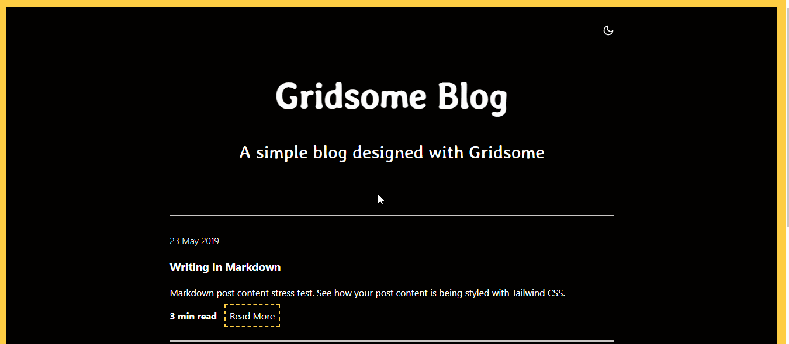

# Gridsome Blog

> A simple blog Gridsome that uses Markdown for content. Gridsome is a JAMStack framework for Vue.js for building static generated websites & apps that are fast.

## User Stories

The following **required** functionality is completed:
- [x]  User can see a list of blog posts
- [x]  User can click on a blog post to read more.

## Preview

GIF created with `LiceCap`.

## Development server

1. Clone repository
2. Navigate to the project folder using the command line and type `npm i`
3. `gridsome develop` to start a local dev server at `http://localhost:8080`
4. Happy coding 🎉🙌

## License

    Copyright [2023] [Marckenson Beaujour]
